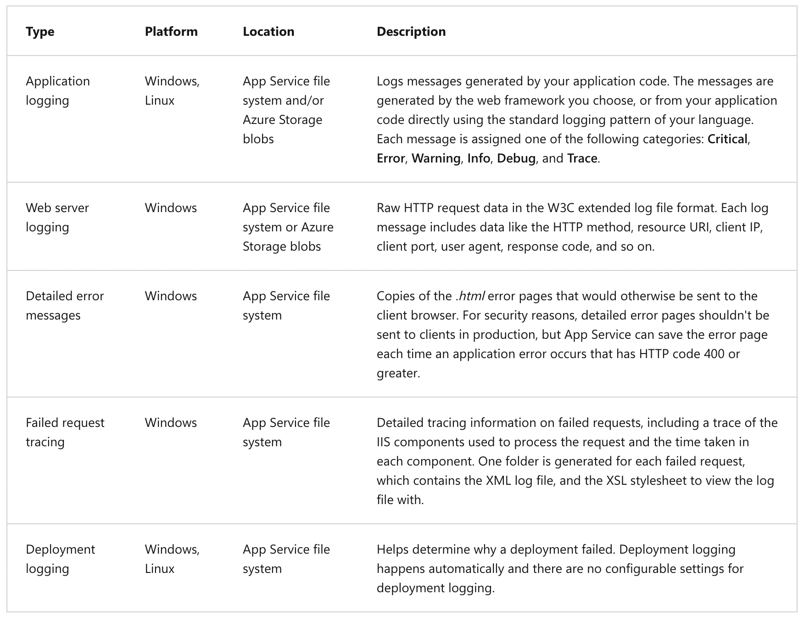
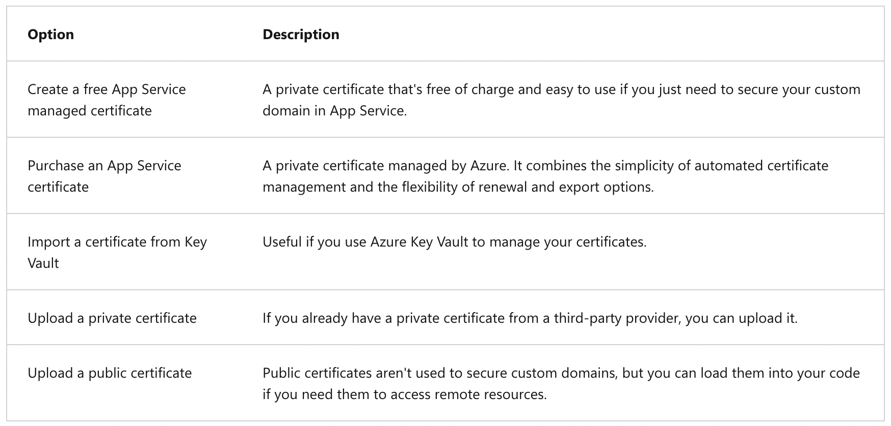

## Explore Azure App Service

### General information

Azure App Service is a fully managed platform designed to simplify the deployment and scaling of web apps, mobile back ends, and RESTful APIs.

Azure App Service is a **PaaS** for hosting web applications.

Azure App Service supports the following scaling options:

- Scale out (the process of increasing the number of instances)
- Scale up (the process of increasing the size of an instance)

App Service Environment is an Azure App Service feature that provides a fully isolated and dedicated environment for running App Service apps. It offers improved security at high scale.

In App Service, an app always runs in an **App Service Plan**. An App Service plan defines a set of compute resources for a web app to run.


---

### Pricing tier

- **Shared compute**: _Free_ and _Shared_, the two base tiers, runs an app on the same Azure VM as other App Service apps, including apps of other customers. These tiers allocate CPU quotas to each app that runs on the shared resources, and the resources can't scale out (These tiers are intended to be used only for _development_ and _testing_ purposes).
- **Dedicated compute**: The _Basic_, _Standard_, _Premium_, _PremiumV2_, and _PremiumV3_ tiers run apps on dedicated Azure VMs. Only apps in the same App Service plans share the same compute resources. The higher the tier, the more VM instances are available to you for scale-out (Support for scaling).
- **Isolated**: The _Isolated_ and _IsolatedV2_ tiers run dedicated Azure VMs on dedicated Azure Virtual Networks. It provides network isolation on top of compute isolation to your apps. It provides the maximum scale-out capabilities.

---

### App needs more capabilities

Isolate your app into a new App Service plan when:

- The app is resource-intensive.
- You want to scale the app independently from the other apps in the existing plan.
- The app needs resources in a different geographical region.

---

### Type of deployment

#### Automated deployment

Automated deployment, or continuous deployment, is a process used to push out new features and bug fixes in a fast and repetitive pattern with minimal effect on end users.

Available options:

- Azure DevOps Services.
- GitHub.
- Bitbucket.

#### Manual deployment

Available options:

- Git.
- CLI.
- Zip deploy.
- FTP/S.

---

### Deployment slots

Whenever possible, use deployment slots when deploying a new production build. When using a _Standard App Service Plan tier or better_, you can deploy your app to a staging environment and then swap your staging and production slots. The swap operation warms up the necessary worker instances to match your production scale, thus eliminating downtime.


---

### Authentication and Authorization

Azure App Service provides built-in authentication and authorization support. You can sign in users and access data by writing minimal or no code in your web app, RESTful API, mobile back end, or Azure Functions.

---

### Networking features

By default, apps hosted in App Service are accessible directly through the internet and can reach internet-hosted endpoints. For many applications, you need to control the inbound and outbound network traffic.

There are two main deployment types for Azure App Service:

- The _multitenant_ public service hosts App Service plans in the Free, Shared, Basic, Standard, Premium, PremiumV2, and PremiumV3 pricing SKUs.
- The _single-tenant_ App Service Environment (ASE) hosts Isolated SKU App Service plans directly in your Azure virtual network.

---

### Execution example:

Resource configurations

Basics:


Container:


App execution:


---

## Configure web app settings

### Application settings

In App Service, app settings are variables passed as environment variables to the application code. When you add, remove, or edit app settings, App Service triggers an app restart.

App settings are always encrypted when stored (_encrypted-at-rest_).

---

### Editing application settings in bulk

To add or edit app settings in bulk, select the **Advanced edit** button. When finished, select **OK**. Don't forget to select Apply back in the Environment variables page. App settings have the following JSON formatting:

```json
[
  {
    "name": "<key-1>",
    "value": "<value-1>",
    "slotSetting": false
  },
  {
    "name": "<key-2>",
    "value": "<value-2>",
    "slotSetting": false
  },
  ...
]
```

---

### Configure general settings

A list of the currently available settings:

- Stack settings (language and SDK versions).
- Platform settings:
  - Platform bitness.
  - FTP state.
  - HTTP version.
  - Web sockets.
  - Always On (Always On is required for continuous WebJobs or for WebJobs that are triggered using a CRON expression).
  - ARR affinity.
  - HTTPS Only.
  - Minimum TLS version.
- Debugging.
- Incoming client certificates.

---

### Diagnostic logging



---

### Configure security certificates

The table below details the options you have for adding certificates in App Service:



---

### Creating a free managed certificate

To create custom TLS/SSL bindings or enable client certificates for your App Service app, your App Service plan must be in the _Basic_, _Standard_, _Premium_, or _Isolated_ tier.

The free App Service managed certificate is a turn-key solution for securing your custom DNS name in App Service. It's a TLS/SSL server certificate fully managed by App Service and renewed continuously and automatically in six-month increments, 45 days before expiration. You create the certificate and bind it to a custom domain, and let App Service do the rest.

---

## Scale apps in Azure App Service

### Scale out options

Azure App Service supports manual scaling, and two options for scaling out your web apps automatically:

- Autoscaling with Azure _autoscale_. Autoscaling makes scaling decisions based on rules that you define.
- Azure App Service _automatic scaling_. Automatic scaling makes scaling decisions for you based on the parameters that you select.

**Autoscaling**: Autoscaling makes its decisions based on rules that you define. A rule specifies the threshold for a metric, and triggers an autoscale event when this threshold is crossed. Autoscaling can also deallocate resources when the workload lessens.

**Automatic scaling** options:

- You don't want to set up autoscale rules based on resource metrics.
- You want your web apps within the same App Service Plan to scale differently and independently of each other.
- Your web app is connected to a database or legacy system, which may not scale as fast as the web app. Scaling automatically allows you to set the maximum number of instances your App Service Plan can scale to. This setting helps the web app to not overwhelm the backend.

### Autoscale factors

Metrics for autoscale rules:

- CPU Percentage.
- Memory Percentage.
- Disk Queue Length.
- Http Queue Length (HTTP requests in the queue).
- Data In.
- Data Out.

### Examples of autoscale rules

_Scale out_ rules:

1. If the HTTP queue length exceeds 10, scale out by 1
2. If the CPU utilization exceeds 70%, scale out by 1

$\text{Scale Out} = RL1 \lor RL2$

_Scale in_ rules:

1. If the HTTP queue length is zero, scale in by 1
2. If the CPU utilization drops below 50%, scale in by 1

$\text{Scale In} = RL1 \land RL2$

### Autoscale best practices

1. Ensure the maximum and minimum values are different and have an adequate margin between them.
2. Choose the appropriate statistic for your diagnostics metric.
3. Choose the thresholds carefully for all metric types.
4. Considerations for scaling when multiple rules are configured in a profile.
5. Always select a safe default instance count.
6. Configure autoscale notifications.

---

## Explore Azure App Service deployment slots

### Swap deployment slots

To swap a staging slot with the production slot, make sure that the production slot is always the target slot. This way, the swap operation doesn't affect your production app.

There are two options:

- Manually swapping deployment slots.
- Automatic swap.

### Route traffic

By default, all client requests to the app's production URL (`http://<app_name>.azurewebsites.net`) are routed to the production slot. You can route a portion of the traffic to another slot. This feature is useful if you need user feedback for a new update, but you're not ready to release it to production.

---
