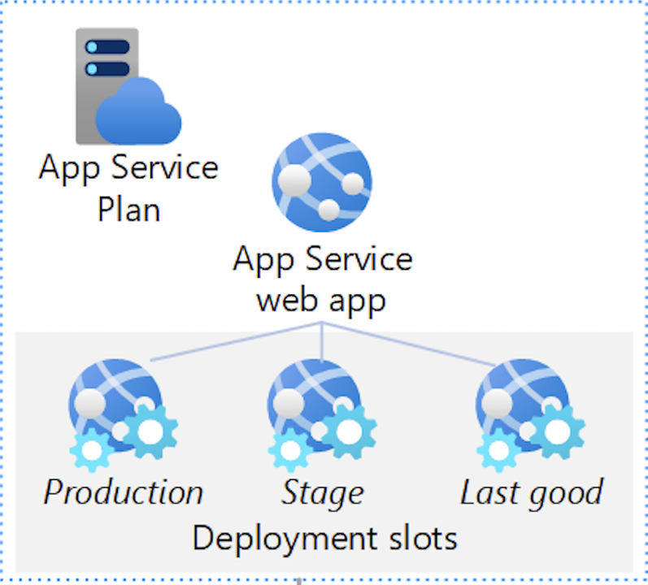
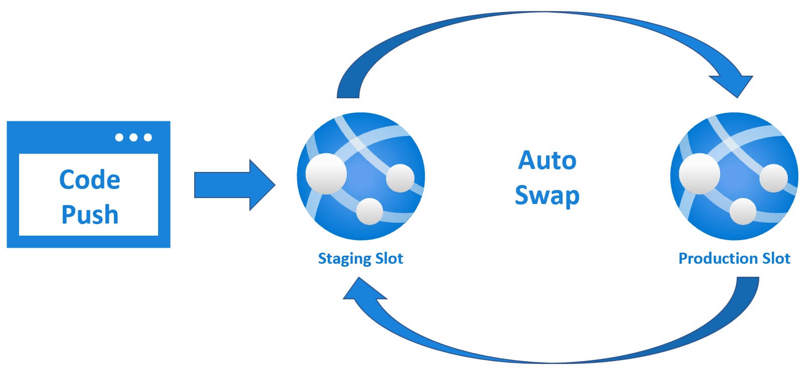
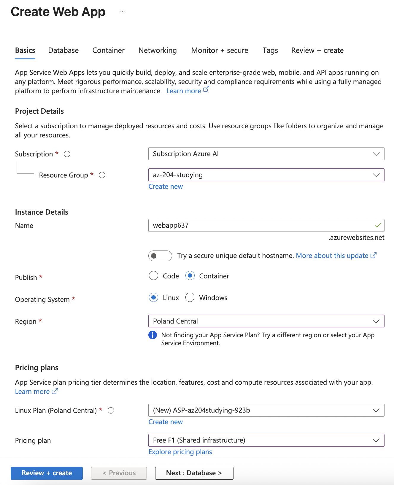
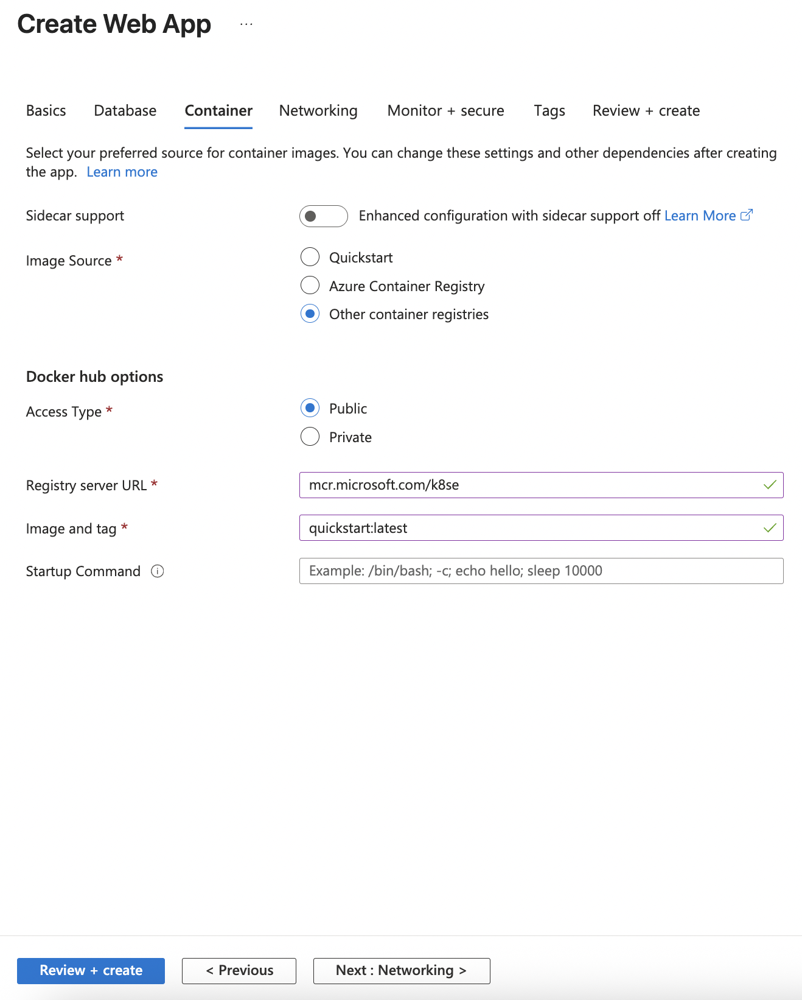
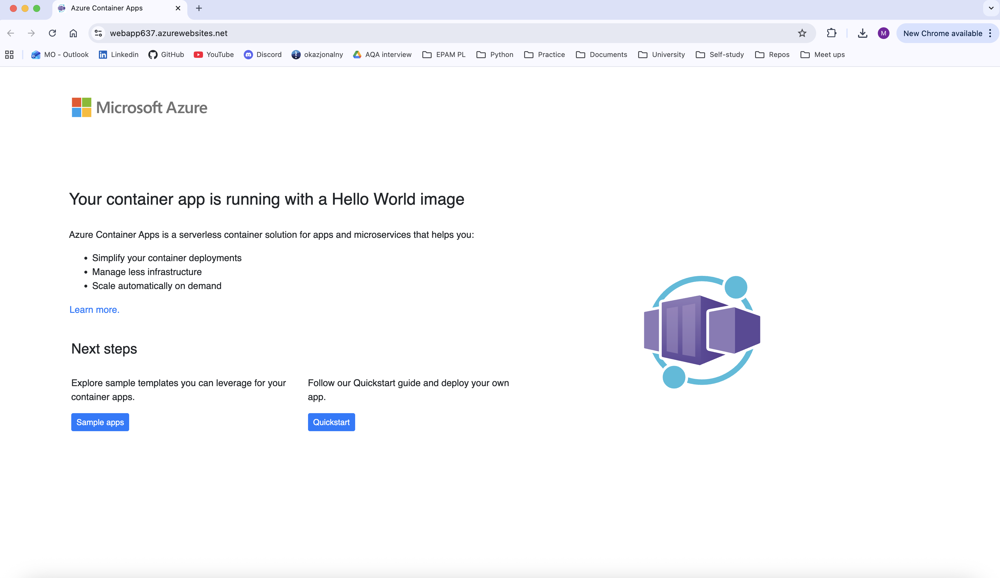

## Explore Azure App Service

---

### General information

Azure App Service is a fully managed platform designed to simplify the deployment and scaling of web apps, mobile back ends, and RESTful APIs.

Azure App Service is a **PaaS** for hosting web applications.

Azure App Service supports the following scaling options:

- Scale out (the process of increasing the number of instances)
- Scale up (the process of increasing the size of an instance)

App Service Environment is an Azure App Service feature that provides a fully isolated and dedicated environment for running App Service apps. It offers improved security at high scale.

In App Service, an app always runs in an **App Service Plan**. An App Service plan defines a set of compute resources for a web app to run.

---

### Pricing tier

- **Shared compute**: _Free_ and _Shared_, the two base tiers, runs an app on the same Azure VM as other App Service apps, including apps of other customers. These tiers allocate CPU quotas to each app that runs on the shared resources, and the resources can't scale out (These tiers are intended to be used only for _development_ and _testing_ purposes).
- **Dedicated compute**: The _Basic_, _Standard_, _Premium_, _PremiumV2_, and _PremiumV3_ tiers run apps on dedicated Azure VMs. Only apps in the same App Service plans share the same compute resources. The higher the tier, the more VM instances are available to you for scale-out (Support for scaling).
- **Isolated**: The _Isolated_ and _IsolatedV2_ tiers run dedicated Azure VMs on dedicated Azure Virtual Networks. It provides network isolation on top of compute isolation to your apps. It provides the maximum scale-out capabilities.

---

### App needs more capabilities

Isolate your app into a new App Service plan when:

- The app is resource-intensive.
- You want to scale the app independently from the other apps in the existing plan.
- The app needs resources in a different geographical region.

---

### Type of deployment

#### Automated deployment

Automated deployment, or continuous deployment, is a process used to push out new features and bug fixes in a fast and repetitive pattern with minimal effect on end users.

Available options:

- Azure DevOps Services.
- GitHub.
- Bitbucket.

#### Manual deployment

Available options:

- Git.
- CLI.
- Zip deploy.
- FTP/S.

---

### Deployment slots

Whenever possible, use deployment slots when deploying a new production build. When using a _Standard App Service Plan tier or better_, you can deploy your app to a staging environment and then swap your staging and production slots. The swap operation warms up the necessary worker instances to match your production scale, thus eliminating downtime.

---

### Authentication and Authorization

Azure App Service provides built-in authentication and authorization support. You can sign in users and access data by writing minimal or no code in your web app, RESTful API, mobile back end, or Azure Functions.

---

### Networking features

By default, apps hosted in App Service are accessible directly through the internet and can reach internet-hosted endpoints. For many applications, you need to control the inbound and outbound network traffic.

There are two main deployment types for Azure App Service:

- The _multitenant_ public service hosts App Service plans in the Free, Shared, Basic, Standard, Premium, PremiumV2, and PremiumV3 pricing SKUs.
- The _single-tenant_ App Service Environment (ASE) hosts Isolated SKU App Service plans directly in your Azure virtual network.

---

#### Execution example:

Resource configurations
Basics:

Container:

App execution:

---

## Configure web app settings

TODO

---

## Scale apps in Azure App Service

TODO

---

## Explore Azure App Service deployment slots

TODO

---
