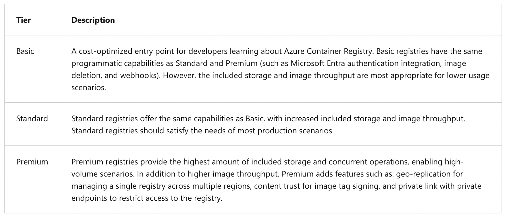
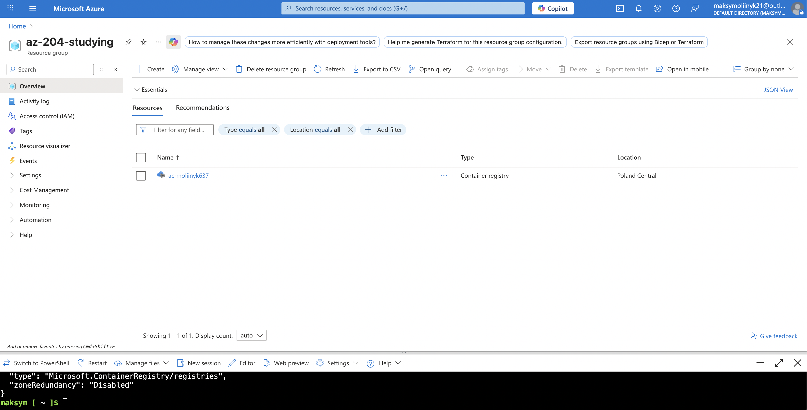
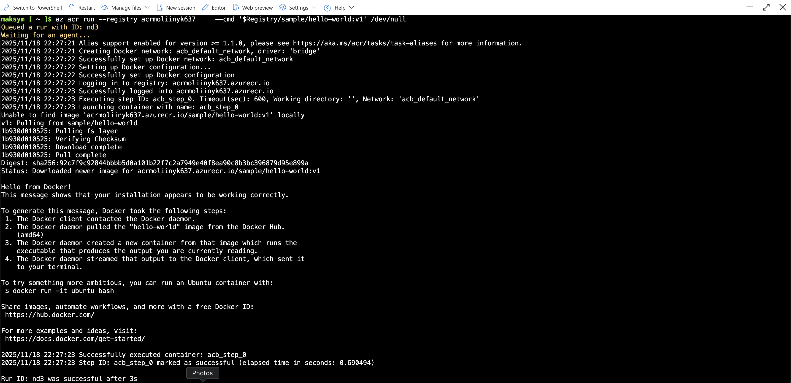
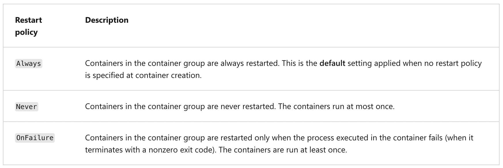
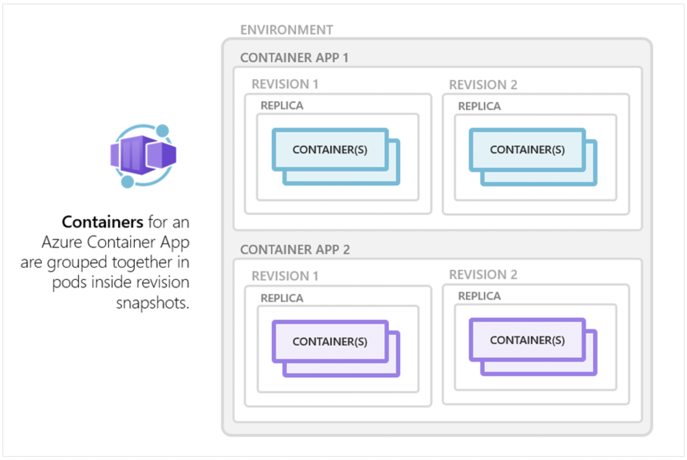
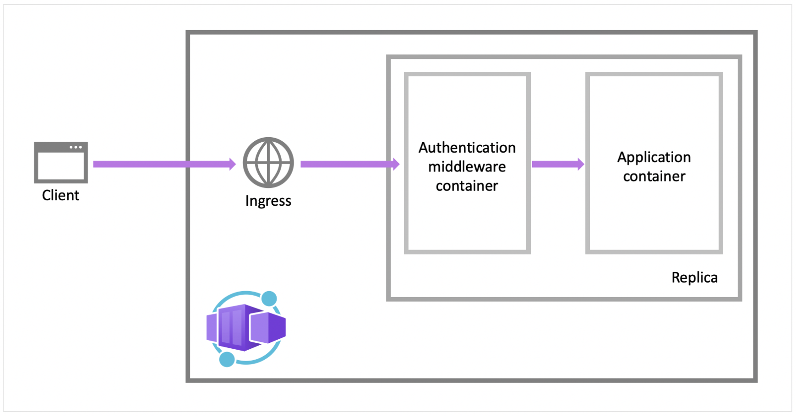
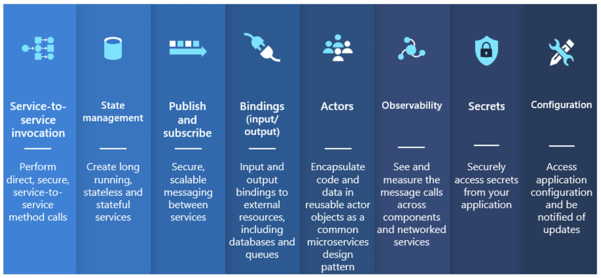

## Containerized solutions

### General information

_Image_:

A package of an application and its dependencies:

- Lightweight.
- Portable.

**Azure Container Registry** (ACR) is a managed registry service based on the open-source Docker Registry 2.0. Create and maintain Azure container registries to store and manage your container images and related artifacts. (There are other solutions like Docker Hub).

---

### Service tiers



---

### Storage capabilities

All Azure Container Registry tiers benefit from advanced Azure storage features like encryption-at-rest for image data security and geo-redundancy for image data protection:

- Encryption-at-rest.
- Regional storage.
- Geo-replication (Only for the Premium tier).
- Zone redundancy.
- Scalable storage.

---

### Build and manage containers with tasks

ACR Tasks supports several scenarios to build and maintain container images and other artifacts:

- _Quick task_ - Build and push a single container image to a container registry on-demand, in Azure, without needing a local Docker Engine installation. Think `docker build`, `docker push` in the cloud.
- _Automatically triggered tasks_ - Enable one or more _triggers_ to build an image:
  - Trigger on source code update.
  - Trigger on base image update.
  - Trigger on a schedule.
- _Multi-step task_ - Extend the single image build-and-push capability of ACR Tasks with multi-step, multi-container-based workflows.

---

### Elements of a Dockerfile

```Dockerfile
# Use the .NET 6 runtime as a base image
FROM mcr.microsoft.com/dotnet/runtime:6.0

# Set the working directory to /app
WORKDIR /app

# Copy the contents of the published app to the container's /app directory
COPY bin/Release/net6.0/publish/ .

# Document that the application listens on port 80 (does not publish it)
EXPOSE 80

# Set the command to run when the container starts
CMD ["dotnet", "MyApp.dll"]
```

---

### Execution example

Creation of ACR:



The process of bulding and pushing an image:


Execution:



---

## Run container images in Azure Container Instances

### General information

Azure Container Instances (ACI) is a great solution for any scenario that can operate in isolated containers, including simple applications, task automation, and build jobs. Here are some of the benefits:

- Fast startup.
- Container access.
- Hypervisor-level security.
- Customer data.
- Custom sizes.
- Persistent storage.
- Linux and Windows.

The following diagram shows an example of a container group that includes multiple containers:


---

### Restart policy



---

### Mount an Azure file share in ACI

By default, Azure Container Instances are stateless. If the container crashes or stops, all of its state is lost. To persist state beyond the lifetime of the container, you must mount a volume from an external store.

To mount multiple volumes in a container instance, you must deploy using an _Azure Resource Manager template_ or a _YAML file_.

---

## Implement containerized solutions (Azure Container Apps)

### General information

Azure Container Apps is a serverless container service that supports microservice applications and robust autoscaling capabilities without the overhead of managing complex infrastructure.

Common uses of Azure Container Apps include:

- Deploying API endpoints.
- Hosting background processing applications.
- Handling event-driven processing.
- Running microservices.

---

### Containers in Azure Container Apps



**!** Running multiple containers in a single container app is an advanced use case. In most situations where you want to run multiple containers, such as when implementing a microservice architecture, deploy each service as a separate container app.

---

### Implement authentication and authorization in Azure Container Apps

Azure Container Apps provides built-in authentication and authorization features to secure your external ingress-enabled container app with minimal or no code. The built-in authentication feature for Container Apps can save you time and effort by providing out-of-the-box authentication with federated identity providers, allowing you to focus on the rest of your application.

- Azure Container Apps provides access to various built-in authentication providers.
- The built-in auth features don’t require any particular language, SDK, security expertise, or even any code that you have to write.

**Feature architecture:**
The authentication and authorization middleware component is a feature of the platform that runs as a sidecar container on each replica in your application. When enabled, every incoming HTTP request passes through the security layer before being handled by your application.



---

### Manage revisions and secrets

Azure Container Apps implements container app versioning by creating revisions. A revision is an immutable snapshot of a container app version. You can use revisions to release a new version of your app, or quickly revert to an earlier version of your app.

You can list all revisions associated with your container app with the `az containerapp revision list` command:

```bash
az containerapp revision list \
  --name <APPLICATION_NAME> \
  --resource-group <RESOURCE_GROUP_NAME> \
  -o table
```

Azure Container Apps allows your application to securely store sensitive configuration values. Once secrets are defined at the application level, secured values are available to container apps. Specifically, you can reference secured values inside scale rules.

**!** Container Apps doesn't support Azure Key Vault integration. Instead, enable managed identity in the container app and use the Key Vault SDK in your app to access secrets.

---

### Dapr

_The Distributed Application Runtime_ (Dapr) is a set of incrementally adoptable features that simplify the authoring of distributed, microservice-based applications. Dapr provides capabilities for enabling application intercommunication through messaging via pub/sub or reliable and secure service-to-service calls.

Dapr APIs:



---

## Useful information regarding ACI

| Feature                       | Supported?                            |
| ----------------------------- | ------------------------------------- |
| Multiple containers per group | Yes (shared network and storage)      |
| Persistent storage            | Yes (via Azure Files)                 |
| Auto-scaling                  | No (use Azure Container Apps instead) |

---
