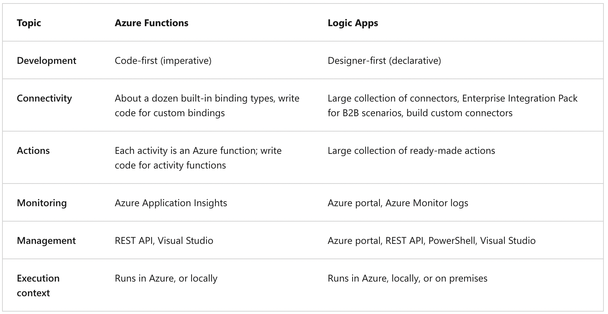
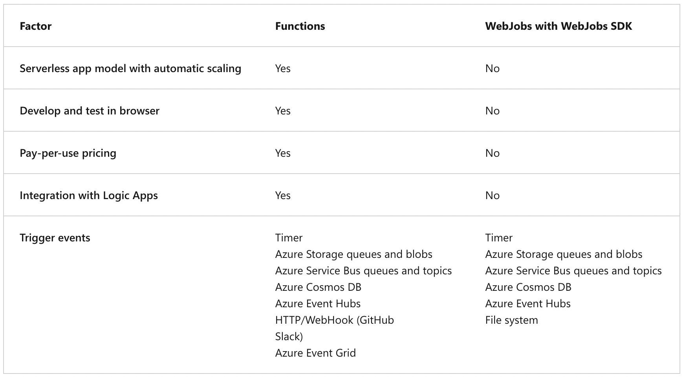
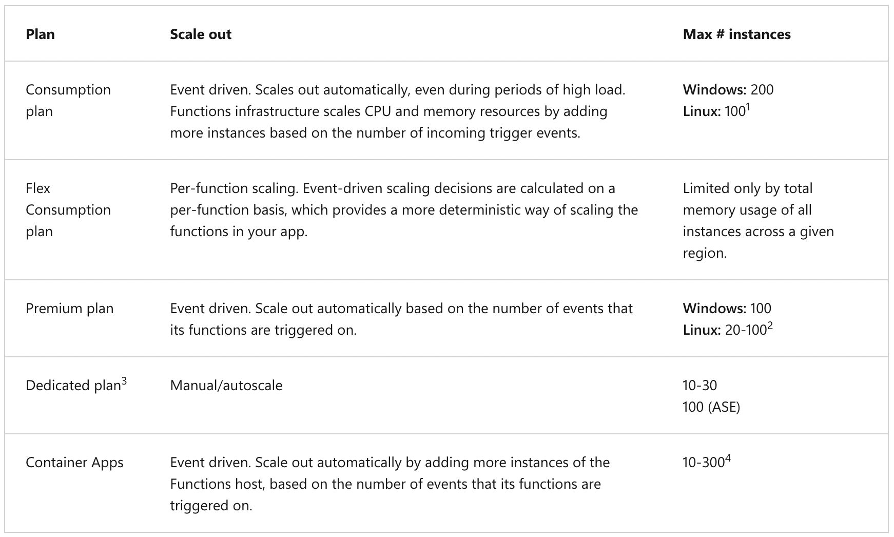
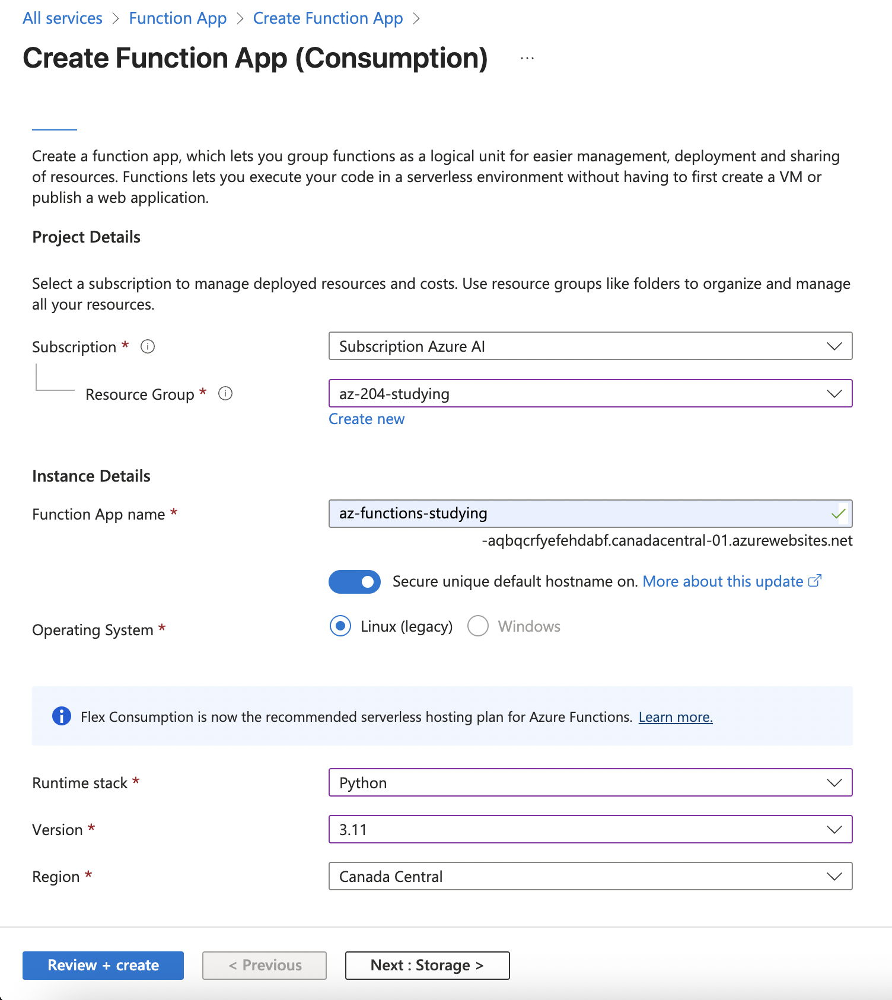
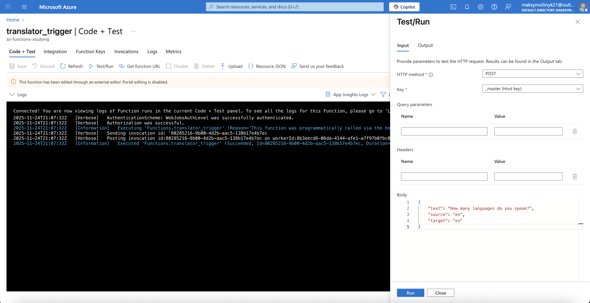
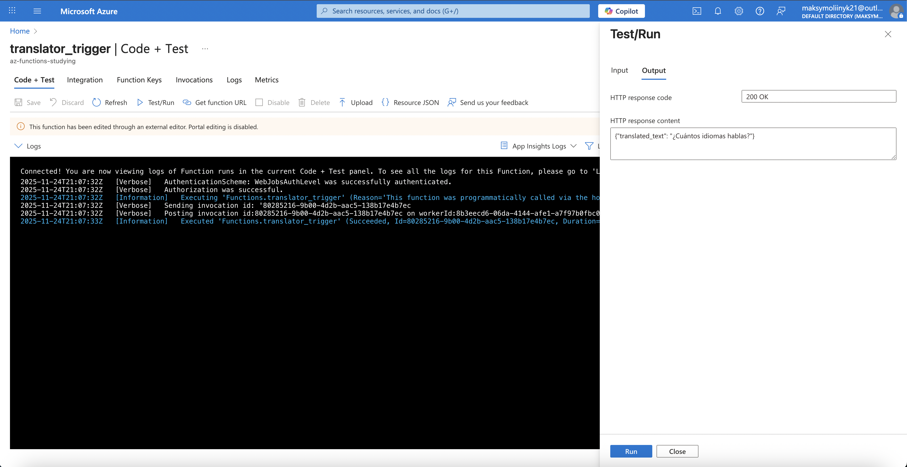

## Azure Functions

### General information

Azure Functions is a serverless solution that allows you to write less code, maintain less infrastructure, and save on costs. Instead of worrying about deploying and maintaining servers, the cloud infrastructure provides all the up-to-date resources needed to keep your applications running.

Azure Functions supports _triggers_, which are ways to start execution of your code, and bindings, which are ways to simplify coding for input and output data.

---

### Azure Functions vs. Azure Logic Apps

Both Functions and Logic Apps are Azure Services that enable serverless workloads. Azure Functions is a serverless compute service, whereas Azure Logic Apps is a serverless workflow integration platform. Both can create complex orchestrations. An orchestration is a collection of functions or steps, called actions in Logic Apps, that are executed to accomplish a complex task.

Durable functions information -> https://learn.microsoft.com/en-us/azure/azure-functions/durable/durable-functions-overview?tabs=in-process%2Cnodejs-v3%2Cv1-model&pivots=python



---

### Azure Functions vs. Azure WebJobs

Like Azure Functions, Azure App Service WebJobs with the WebJobs SDK is a code-first integration service that is designed for developers. Both are built on Azure App Service and support features such as source control integration, authentication, and monitoring with Application Insights integration.



---

### Hosting options

Following is a summary of the benefits of the various hosting options:

1. _Consumption plan:_ The Consumption plan is the default hosting plan. Pay for compute resources only when your functions are running (pay-as-you-go) with automatic scale. On the Consumption plan, instances of the Functions host are dynamically added and removed based on the number of incoming events.
2. _Flex Consumption plan:_ Get high scalability with compute choices, virtual networking, and pay-as-you-go billing. On the Flex Consumption plan, instances of the Functions host are dynamically added and removed based on the configured per instance concurrency and the number of incoming events. You can reduce cold starts by specifying the number of pre-provisioned (always ready) instances. Scales automatically based on demand.
3. _Premium plan:_ Automatically scales based on demand using prewarmed workers, which run applications with no delay after being idle, runs on more powerful instances, and connects to virtual networks.
4. _Dedicated plan:_ Run your functions within an App Service plan at regular App Service plan rates. Best for long-running scenarios where Durable Functions can't be used.
5. _Container Apps:_ Create and deploy containerized function apps in a fully managed environment hosted by Azure Container Apps.

---

### Scale Azure Functions



---

## Develop Azure Functions

### General information

**!** All of the functions in a function app share the same pricing plan, deployment method, and runtime version.

---

### Local project files

A Functions project directory contains the following files in the project root folder, regardless of language:

- `host.json`.
- `local.settings.json`.
- Other files in the project depend on your language and specific functions.

---

### Triggers and Bindings

A trigger defines how a function is invoked and a function must have exactly one trigger. Triggers have associated data, which is often provided as the payload of the function.

| Trigger               | Event Source           | Example Usage                       |
| --------------------- | ---------------------- | ----------------------------------- |
| **HTTP Trigger**      | Web request            | APIs, webhooks                      |
| **Timer Trigger**     | CRON schedule          | Schedule jobs (e.g., cleanup tasks) |
| Queue Storage Trigger | Message added to queue | Background processing               |
| Service Bus Trigger   | Message / event bus    | Enterprise workflows                |
| Event Hub Trigger     | Event stream           | Telemetry ingestion                 |
| Cosmos DB Trigger     | Item changed in DB     | Sync and processing events          |
| Blob Storage Trigger  | Blob created / updated | File processing                     |

Binding to a function is a way of declaratively connecting another resource to the function; bindings might be connected as input bindings, output bindings, or both. Data from bindings is provided to the function as parameters.

| Binding              | Type                 | Description                      |
| -------------------- | -------------------- | -------------------------------- |
| Queue Storage        | Trigger/Input/Output | Processes queued messages        |
| Blob Storage         | Trigger/Input/Output | Handles file uploads/changes     |
| Table Storage        | Input/Output         | Read/write structured NoSQL data |
| Cosmos DB            | Trigger/Input/Output | Read/write Cosmos DB items       |
| Service Bus          | Trigger/Input/Output | Messaging integration            |
| HTTP                 | Trigger/Output       | Respond to web requests          |
| Event Grid/Event Hub | Trigger/Input        | Handles large event streams      |

All triggers and bindings have a direction property in the _function.json_ file:

- `in` -> for triggers.
- `in` and `out` -> for bindings.
- `inout` -> for bindings.

---

### Example execution

1. Creation of Azure Function App service:



2. Azure Function structure in VS Code:

- _function_app.py_: The default location for all functions and their related triggers and bindings.
- _.funcignore_: Declares files that shouldn't get published to Azure. Usually, this file contains _.vscode/_ to ignore your editor setting, _.venv/_ to ignore local Python virtual environment, _tests/_ to ignore test cases, and _local.settings.json_ to prevent local app settings being published.
- _host.json_: Contains configuration options that affect all functions in a function app instance. This file does get published to Azure. Not all options are supported when running locally.
- _local.settings.json_: Used to store app settings and connection strings when it's running locally. This file doesn't get published to Azure.
- _requirements.txt_: Contains the list of Python packages the system installs when it publishes to Azure.

3. Content of the _function_app.py_ file:

```python
import json

from enum import Enum

from http import HTTPStatus

import azure.functions as func

from deep_translator import GoogleTranslator

app = func.FunctionApp(http_auth_level=func.AuthLevel.FUNCTION)


class SupportedLanguages(str, Enum):
    ENGLISH = "en"
    GERMAN = "de"
    FRENCH = "fr"
    SPANISH = "es"
    PORTUGUESE = "pt"

    @classmethod
    def list(cls) -> list[str]:
        return [language.value for language in cls]


@app.route(route="translator_trigger", methods=["POST"])
def translator_trigger(req: func.HttpRequest) -> func.HttpResponse:
    request_body = req.get_json()

    text_to_translate = request_body.get("text", None)
    source_language = request_body.get("source", None)
    target_language = request_body.get("target", None)

    if not text_to_translate:
        return func.HttpResponse(
            body="Missing the 'text' field in request body",
            status_code=HTTPStatus.BAD_REQUEST,
        )

    if (
        source_language not in SupportedLanguages.list()
        or target_language not in SupportedLanguages.list()
    ):
        return func.HttpResponse(
            body="The provided language is not supported",
            status_code=HTTPStatus.BAD_REQUEST,
        )

    try:

        translated_text = GoogleTranslator(
            source=source_language, target=target_language
        ).translate(text=text_to_translate)

    except Exception as error:
        return func.HttpResponse(
            body=f"Translation failed: {str(error)}",
            status_code=HTTPStatus.INTERNAL_SERVER_ERROR,
        )

    return func.HttpResponse(
        body=json.dumps({"translated_text": translated_text}, ensure_ascii=False),
        mimetype="application/json",
        status_code=HTTPStatus.OK,
    )
```

4. Function execution:





---
