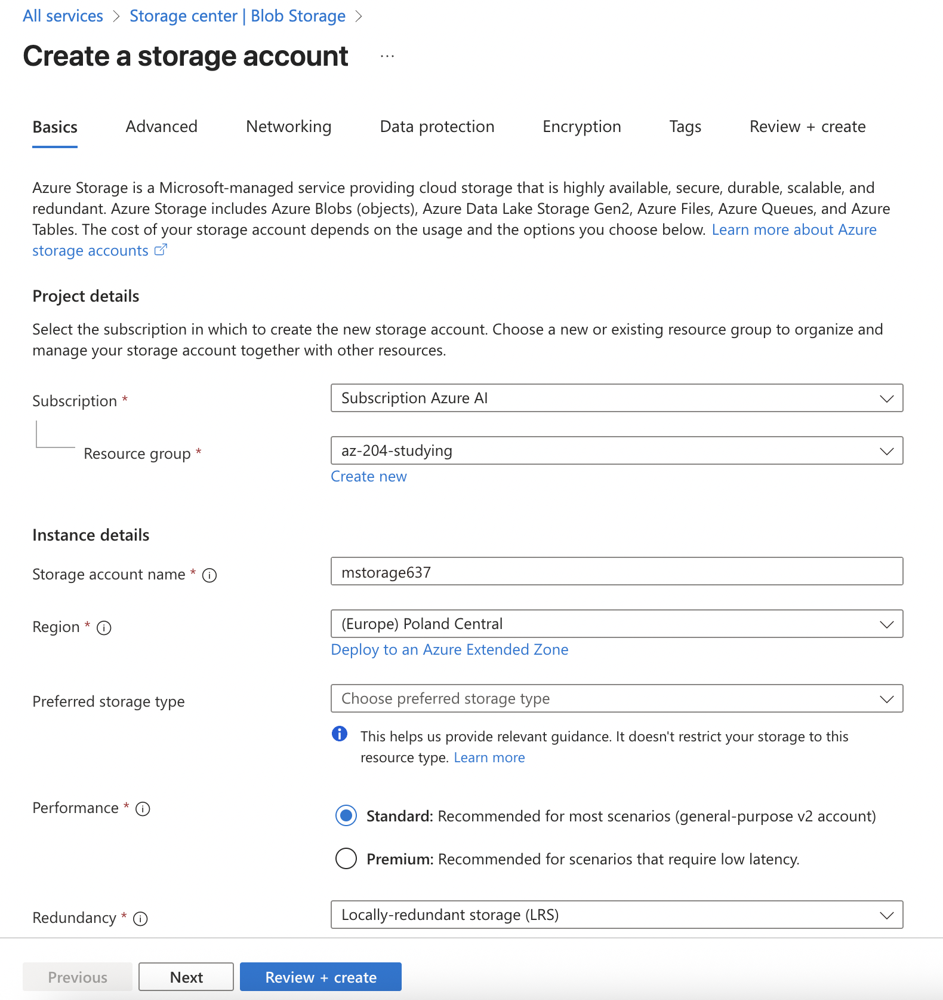
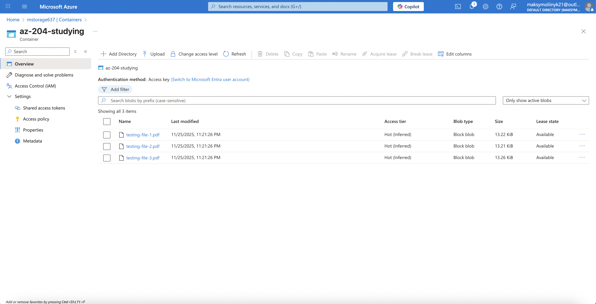

## Azure Blob storage

### General information

Azure Blob storage is Microsoft's object storage solution for the cloud. Blob storage is optimized for storing massive amounts of unstructured data. Unstructured data is data that doesn't adhere to a particular data model or definition, such as text or binary data.

---

### Types of storage accounts

- **Standard:** This is the standard general-purpose v2 account and is recommended for most scenarios using Azure Storage.
- **Premium:** Premium accounts offer higher performance by using solid-state drives. If you create a premium account you can choose between three account types, block blobs, page blobs, or file shares.

---

### Access tiers for block blob data

The available access tiers are:

- The **Hot** access tier, which is optimized for frequent access of objects in the storage account. The Hot tier has the highest storage costs, but the lowest access costs. New storage accounts are created in the hot tier by default.
- The **Cool** access tier, which is optimized for storing large amounts of data that is infrequently accessed and stored for a minimum of 30 days. The Cool tier has lower storage costs and higher access costs compared to the Hot tier.
- The **Cold** access tier, which is optimized for storing data that is infrequently accessed and stored for a minimum of 90 days. The cold tier has lower storage costs and higher access costs compared to the cool tier.
- The **Archive** tier, which is available only for individual block blobs. The archive tier is optimized for data that can tolerate several hours of retrieval latency and remains in the Archive tier for a minimum 180 days. The archive tier is the most cost-effective option for storing data, but accessing that data is more expensive than accessing data in the hot or cool tiers.

---

### Resource types

Blob storage offers three types of resources:

- The _storage account_.
- A _container_ in the storage account.
- A _blob_ in a container.

Azure Storage supports three types of blobs:

- **Block blobs** store text and binary data. Block blobs are made up of blocks of data that can be managed individually. Block blobs can store up to about 190.7 TiB.
- **Append blobs** are made up of blocks like block blobs, but are optimized for append operations. Append blobs are ideal for scenarios such as logging data from virtual machines.
- **Page blobs** store random access files up to 8 TB in size. Page blobs store virtual hard drive (VHD) files and serve as disks for Azure virtual machines.

---

### Security features

Azure Storage automatically encrypts your data when persisting it to the cloud. Encryption protects your data and helps you meet your organizational security and compliance commitments. Data in Azure Storage is encrypted and decrypted transparently using 256-bit Advanced Encryption Standard (AES) encryption, one of the strongest block ciphers available, and is Federal Information Processing Standards (FIPS) 140-2 compliant. Azure Storage encryption is similar to BitLocker encryption on Windows.

**!** Azure Storage encryption is enabled for all storage accounts and can't be disabled.

---

## Manage the Azure Blob storage lifecycle

### Manage the data lifecycle

Azure Blob Storage lifecycle management offers a rule-based policy that you can use to transition blob data to the appropriate access tiers or to expire data at the end of the data lifecycle.

---

### Lifecycle policies

A lifecycle management policy is a collection of rules in a JSON document. Each rule definition within a policy includes a filter set and an action set.

```json
{
  "rules": [
    {
      "name": "rule1",
      "enabled": true,
      "type": "Lifecycle",
      "definition": {...}
    },
    {
      "name": "rule2",
      "type": "Lifecycle",
      "definition": {...}
    }
  ]
}
```

**!** You can define up to 100 rules in a policy.

Full management policy:

```json
{
  "rules": [
    {
      "enabled": true,
      "name": "sample-rule",
      "type": "Lifecycle",
      "definition": {
        "actions": {
          "baseBlob": {
            "tierToCool": {
              "daysAfterModificationGreaterThan": 30
            },
            "tierToArchive": {
              "daysAfterModificationGreaterThan": 90,
              "daysAfterLastTierChangeGreaterThan": 7
            },
            "delete": {
              "daysAfterModificationGreaterThan": 2555
            }
          },
          "snapshot": {
            "delete": {
              "daysAfterCreationGreaterThan": 90
            }
          }
        },
        "filters": {
          "blobTypes": ["blockBlob"],
          "prefixMatch": ["sample-container/blob1"]
        }
      }
    }
  ]
}
```

---

### Rehydrate blob data from the archive tier

While a blob is in the archive access tier, it's considered to be offline and can't be read or modified. In order to read or modify data in an archived blob, you must first rehydrate the blob to an online tier, either the hot or cool tier. There are two options for rehydrating a blob that is stored in the archive tier:

- _Copy an archived blob to an online tier_.
- _Change a blob's access tier to an online tier_.

---

## Work with Azure Blob storage

### Properties and Metadata

| Feature        | Description                    | Examples                                              |
| -------------- | ------------------------------ | ----------------------------------------------------- |
| **Properties** | System-defined blob attributes | `Content-type`, `ETag`, `Last-Modified`, `LeaseState` |
| **Metadata**   | User-defined key-value pairs   | `{"owner": "Maksym", "env": "production"}`            |

---

### Azure storage interaction with Python SDK

1. Creation of Azure Blob storage:



2. Basic operations using the Python SDK:

**Upload a blob (s)**:

```python
for file_path in [
    "data/testing-file-1.pdf",
    "data/testing-file-2.pdf",
    "data/testing-file-3.pdf"
]:
    blob_name = file_path.split("/")[-1]
    blob_client = container_client.get_blob_client(blob_name)

    with open(file_path, mode="rb") as data:
        blob_client.upload_blob(data, overwrite=True)

    print(f"Uploaded '{file_path}' as blob '{blob_name}'")
```

```text
Uploaded 'data/testing-file-1.pdf' as blob 'testing-file-1.pdf'
Uploaded 'data/testing-file-2.pdf' as blob 'testing-file-2.pdf'
Uploaded 'data/testing-file-3.pdf' as blob 'testing-file-3.pdf'
```



**List Blobs**:

```python
for blob in container_client.list_blobs():
    print(f"Name - {blob.name}, Size - {blob.size}")
```

```text
Name - testing-file-1.pdf, Size - 13533
Name - testing-file-2.pdf, Size - 13529
Name - testing-file-3.pdf, Size - 13581
```

**Delete a blob (s)**:

```python
blob_client = container_client.get_blob_client("testing-file-3.pdf")
blob_client.delete_blob()
```

**Blob properties and metadata**:

```python
blob_client = container_client.get_blob_client("testing-file-1.pdf")
blob_client.set_blob_metadata({"owner": "Maksym", "env": "production"})

properties = blob_client.get_blob_properties()

print(f"Metadata - {properties.metadata}")
print(f"Content type property - {properties.content_settings.content_type}")
```

```text
Metadata - {'owner': 'Maksym', 'env': 'production'}
Content type property - application/octet-stream
```

---
