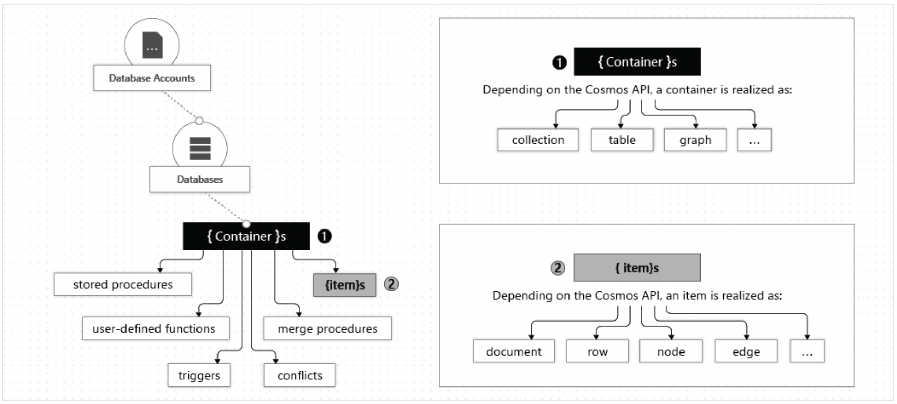
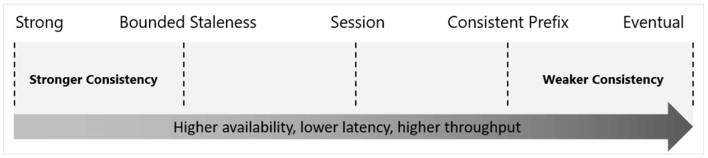
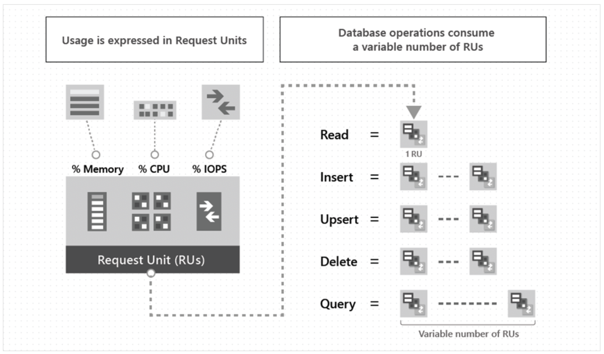
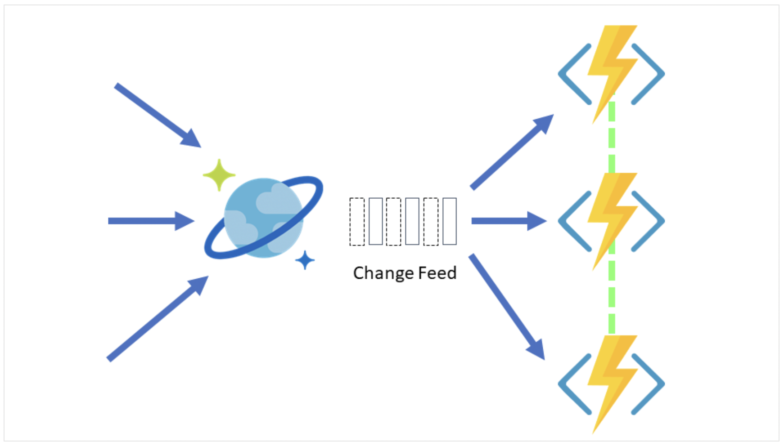
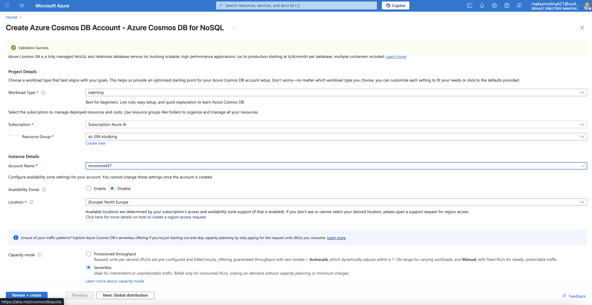
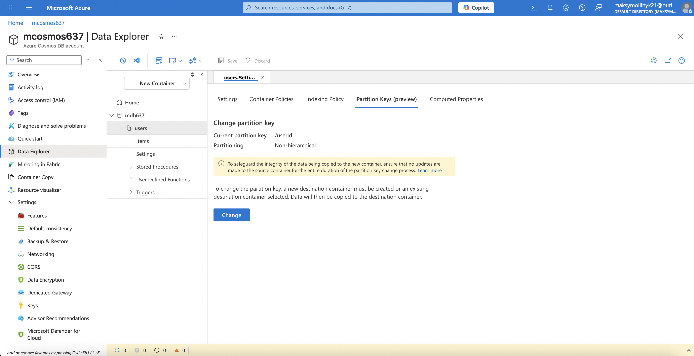

## Azure Cosmos DB

### General information

Azure Cosmos DB is a fully managed NoSQL database designed to provide low latency, elastic scalability of throughput, well-defined semantics for data consistency, and high availability.

You can configure your databases to be globally distributed and available in any of the Azure regions.

---

### The resource hierarchy

**!** Currently, you can create a maximum of 50 Azure Cosmos DB accounts under an Azure subscription.

**Key Terms**:

| Term                  | Meaning                                                       |
| --------------------- | ------------------------------------------------------------- |
| **Database**          | Logical grouping of containers                                |
| **Container**         | Stores JSON items; horizontally scalable                      |
| **Item**              | A JSON document                                               |
| **Partition Key**     | Determines how data is distributed across physical partitions |
| **Throughput (RU/s)** | Cost measure for operations                                   |

**!Important:** Choosing a good **partition key** (high cardinality, even distribution) is critical for performance and cost.

Example:

Suppose you store order documents:

```json
{
  "orderId": "123",
  "userId": "u321",
  "amount": 99.5
}
```

If your _partition key_ = `"userId"`
Then:

- All orders from `"u321"` go to the same logical partition
- Each user gets their own partition
- High cardinality (thousands of users)
- Even load (users order at similar rates)

So, this is a _good_ partition key

The following image shows the hierarchy of different entities in an Azure Cosmos DB account:



---

### Consistency levels

| Consistency Level     | Guarantee                                  |
| --------------------- | ------------------------------------------ |
| **Strong**            | Reads always return latest committed write |
| **Bounded Staleness** | Reads lag behind by a time window          |
| **Session** (Default) | Read your own writes                       |
| **Consistent Prefix** | Guaranteed ordered writes (1, 2, 3, 4, 5)  |
| **Eventual**          | No ordering guarantee (5, 2, 3, 1, 4)      |



---

### Supported APIs

- API for NoSQL.
- API for MongoDB.
- API for PostgreSQL.
- API for Apache Cassandra.
- API for Apache Gremlin.
- API for Table.

---

### Request units (RU)

Request unites (RUs) - a unit of measurement used to express the cost of all database operations in Azure Cosmos DB.



---

## Work with Azure Cosmos DB

### Stored procedures

Azure Cosmos DB provides language-integrated, transactional execution of JavaScript that lets you write _stored procedures_, _triggers_, and _user-defined functions (UDFs)_.

---

### Change feed notifications

Change feed in Azure Cosmos DB is a persistent record of changes to a container in the order they occur (It does not include deletes).

You can create small reactive Azure Functions that are automatically triggered on each new event in your Azure Cosmos DB container's change feed. With the **Azure Functions trigger for Azure Cosmos DB**, you can use the Change Feed Processor's scaling and reliable event detection functionality without the need to maintain any worker infrastructure.



There are four main components of implementing the change feed processor:

1. **The monitored container**: The monitored container has the data from which the change feed is generated. Any inserts and updates to the monitored container are reflected in the change feed of the container.
2. **The lease container**: The lease container acts as a state storage and coordinates processing the change feed across multiple workers. The lease container can be stored in the same account as the monitored container or in a separate account.
3. **The compute instance**: A compute instance hosts the change feed processor to listen for changes. Depending on the platform, it might be represented by a VM, a kubernetes pod, an Azure App Service instance, an actual physical machine. It has a unique identifier referenced as the instance name throughout this article.
4. **The delegate**: The delegate is the code that defines what you, the developer, want to do with each batch of changes that the change feed processor reads.

---

### Azure Cosmos DB interaction with Python SDK

1. Creation of Azure Cosmos DB:



2. Basic operations using the Python SDK:

**Create Database and Container**:

```python
database_client = cosmos_client.create_database_if_not_exists("mdb637")
container_client = database_client.create_container_if_not_exists(
    id="users",
    partition_key=PartitionKey(path="/userId"),
)
```



**Create item (s)**:

```python
users = [
    {
        "id": "1",
        "userId": "u111",
        "name": "Maksym",
    },
    {
        "id": "2",
        "userId": "u222",
        "name": "Bohdan",
    },
]

for user in users:
    container_client.create_item(user)
```

**Read item (s)**:

```python
for item, user_id in [("1", "u111"), ("2", "u222")]:
    print(container_client.read_item(item=item, partition_key=user_id))
```

```text
{'id': '1', 'userId': 'u111', 'name': 'Maksym', '_rid': 'HdVTAPMzQJEBAAAAAAAAAA==', '_self': 'dbs/HdVTAA==/colls/HdVTAPMzQJE=/docs/HdVTAPMzQJEBAAAAAAAAAA==/', '_etag': '"c9023dcc-0000-0c00-0000-6928d81e0000"', '_attachments': 'attachments/', '_ts': 1764284446}
{'id': '2', 'userId': 'u222', 'name': 'Bohdan', '_rid': 'HdVTAPMzQJECAAAAAAAAAA==', '_self': 'dbs/HdVTAA==/colls/HdVTAPMzQJE=/docs/HdVTAPMzQJECAAAAAAAAAA==/', '_etag': '"c9023ecc-0000-0c00-0000-6928d81e0000"', '_attachments': 'attachments/', '_ts': 1764284446}
```

**Query item (s)**:

```python
items = container_client.query_items(
    query="SELECT c.name FROM c WHERE c.userId = @uid",
    parameters=[{"name": "@uid", "value": "u111"}],
    enable_cross_partition_query=True,
)

for item in items:
    print(item)
```

```text
{'name': 'Maksym'}
```

**Delete item (s)**:

```python
container_client.delete_item(item="1", partition_key="u111")
```

---
