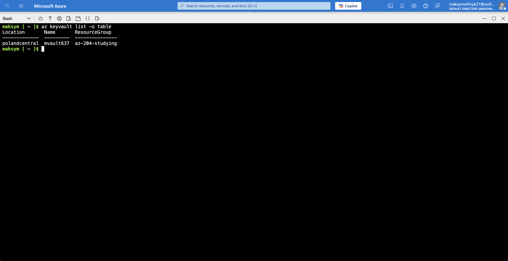
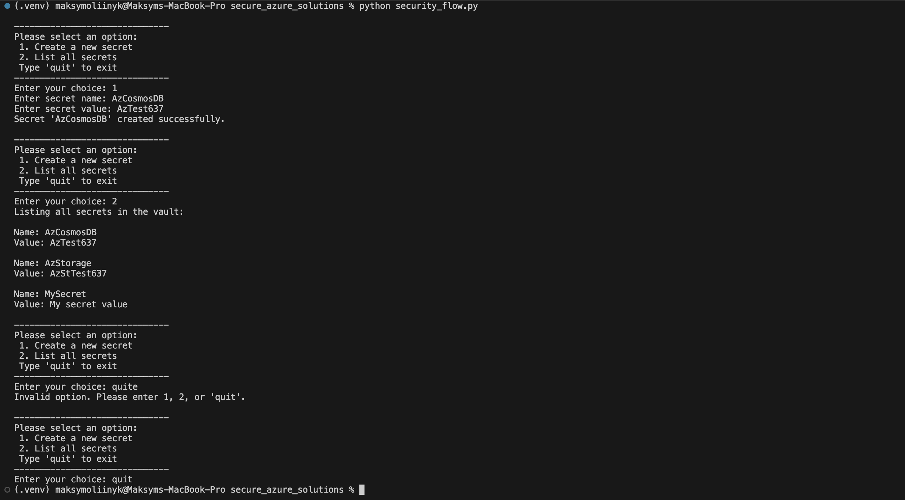
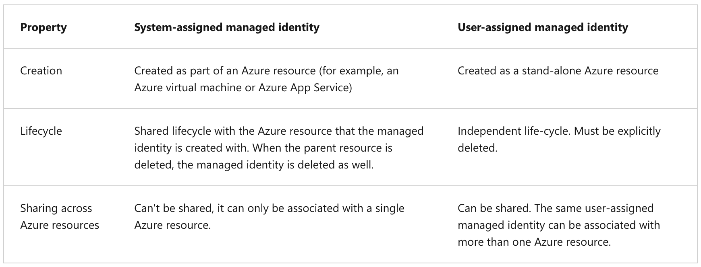

## Secure Azure solutions

### Azure Key Vault general information

The Azure Key Vault service supports two types of containers: vaults and managed hardware security module (HSM) pools. Vaults support storing software and HSM-backed keys, secrets, and certificates. Managed HSM pools only support HSM-backed keys.

Azure Key Vault helps solve the following problems:

- Secrets Management.
- Key Management.
- Certificate Management.

Azure Key Vault has two service tiers: **Standard** and **Premium**.

---

### Key benefits of using Azure Key Vault

- **Centralized application secrets**.
- **Securely store secrets and keys**.
- **Monitor access and use**.
- **Simplified administration of application secrets**.

---

### Authentication

To do any operations with Key Vault, you first need to authenticate to it. There are three ways to authenticate to Key Vault:

- **Managed identities for Azure resources**.
- **Service principal and certificate**.
- **Service principal and secret**.

---

### Azure Key Vault best practices

- **Use separate key vaults**: Recommended using a vault per application per environment (Development, Pre-Production and Production). This pattern helps you not share secrets across environments and also reduces the threat if there is a breach.
- **Control access to your vault**: Key Vault data is sensitive and business critical, you need to secure access to your key vaults by allowing only authorized applications and users.
- **Backup**: Create regular back ups of your vault on update/delete/create of objects within a Vault.
- **Logging**: Be sure to turn on logging and alerts.
- **Recovery options**: Turn on soft-delete and purge protection if you want to guard against force deletion of the secret.

---

### Authentication to Key Vault in application code

**!** Key Vault SDK is using Azure Identity client library, which allows seamless authentication to Key Vault across environments with same code.

---

### Using Azure Key Vault with the Python SDK

1. Creation of Azure Key Vault service:

```bash
az keyvault create --name $keyVaultName \
    --resource-group $resourceGroup --location $location
```



2. Commands for assigning a role to your Microsoft Entra user name:

Retrieve the _userPrincipalName_ from your account:

```bash
userPrincipal=$(az rest --method GET --url https://graph.microsoft.com/v1.0/me \
    --headers 'Content-Type=application/json' \
    --query userPrincipalName --output tsv)
```

Retrieve the resource ID of the key vault:

```bash
resourceID=$(az keyvault show --resource-group $resourceGroup \
    --name $keyVaultName --query id --output tsv)
```

Create and assign the Key Vault Secrets Officer role:

```bash
az role assignment create --assignee $userPrincipal \
    --role "Key Vault Secrets Officer" \
    --scope $resourceID
```

3. Commands to add and retrieve a secret with Azure CLI:

Create a secret:

```bash
az keyvault secret set --vault-name $keyVaultName \
    --name "MySecret" --value "My secret value"
```

Retrieve the secret:

```bash
az keyvault secret show --name "MySecret" --vault-name $keyVaultName
```

This command returns some JSON. The last line contains the password in plain text.

```text
"value": "My secret value"
```

4. Console app to store and retrieve secrets:

Console app code:

```python
import os

from dotenv import load_dotenv

from azure.identity import DefaultAzureCredential
from azure.keyvault.secrets import SecretClient


load_dotenv("env/.secrets.env")

KEY_VAULT_URL = f"https://{os.getenv('KEY_VAULT_NAME')}.vault.azure.net"


def execute_security_flow():
    credential = DefaultAzureCredential()
    client = SecretClient(vault_url=KEY_VAULT_URL, credential=credential)

    while True:
        print(
            f"\n{'-' * 30}"
            "\nPlease select an option:"
            "\n 1. Create a new secret"
            "\n 2. List all secrets"
            "\n Type 'quit' to exit"
            f"\n{'-' * 30}"
        )

        choice = input("Enter your choice: ").strip().lower()

        match choice:
            case "1":
                create_secret(client)
            case "2":
                list_secrets(client)
            case "quit":
                break
            case _:
                print("Invalid option. Please enter 1, 2, or 'quit'.")


def create_secret(client: SecretClient):
    secret_name = input("Enter secret name: ").strip()
    secret_value = input("Enter secret value: ").strip()

    if not secret_name or not secret_value:
        print("Secret name and value cannot be empty.")
        return

    client.set_secret(name=secret_name, value=secret_value)
    print(f"Secret '{secret_name}' created successfully.")


def list_secrets(client: SecretClient):
    print("Listing all secrets in the vault:")

    for secret_prop in client.list_properties_of_secrets():
        secret = client.get_secret(secret_prop.name)
        print(f"\nName: {secret.name} \nValue: {secret.value}")


if __name__ == "__main__":
    execute_security_flow()
```

Console app execution:



---

## Managed identities

### Types of managed identities

There are two types of managed identities:

- A **system-assigned managed identity** is enabled directly on an Azure service instance. When the identity is enabled, Azure creates an identity for the instance in the Microsoft Entra tenant trusted by the subscription of the instance. After the identity is created, the credentials are provisioned onto the instance. The lifecycle of a system-assigned identity is directly tied to the Azure service instance that it's enabled on. If the instance is deleted, Azure automatically cleans up the credentials and the identity in Microsoft Entra ID.
- A **user-assigned managed identity** is created as a standalone Azure resource. Through a create process, Azure creates an identity in the Microsoft Entra tenant that's trusted by the subscription in use. After the identity is created, the identity can be assigned to one or more Azure service instances. The lifecycle of a user-assigned identity is managed separately from the lifecycle of the Azure service instances to which it's assigned.



---

### Configure managed identities

Enable system-assigned managed identity during creation of an Azure virtual machine:

```bash
az vm create --resource-group myResourceGroup \
    --name myVM --image win2016datacenter \
    --generate-ssh-keys \
    --assign-identity \
    --role contributor \
    --scope mySubscription \
    --admin-username azureuser \
    --admin-password myPassword12
```

Assign a user-assigned managed identity during the creation of an Azure virtual machine:

```bash
az vm create --resource-group <RESOURCE GROUP> \
    --name <VM NAME> --image Ubuntu2204 \
    --admin-username <USER NAME> \
    --admin-password <PASSWORD> \
    --assign-identity <USER ASSIGNED IDENTITY NAME> \
    --role <ROLE> \
    --scope <SUBSCRIPTION>
```

---

## Azure App Configuration

### General information

TODO

---
