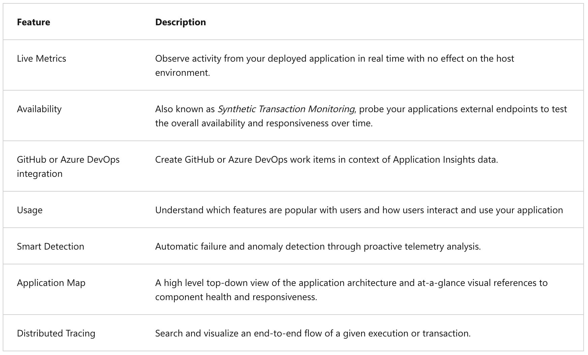

## Troubleshoot solutions by using Application Insights

### General information

Application Insights is an extension of Azure Monitor and provides Application Performance Monitoring (APM) features. APM tools are useful to monitor applications from development, through test, and into production in the following ways:

- Proactively understand how an application is performing.
- Reactively review application execution data to determine the cause of an incident.

Application Insights feature overview:

---

### Log-based metrics

Application Insights log-based metrics let you analyze the health of your monitored apps, create powerful dashboards, and configure alerts. There are two kinds of metrics:

- **Log-based metrics** behind the scene are translated into Kusto queries from stored events.
- **Standard metrics** are stored as preaggregated time series (provides near real-time querying and alerting on dimensions of metrics, and more responsive dashboards).

---

### Instrument an app for monitoring

At a basic level, "instrumenting" is simply enabling an application to capture telemetry. There are two methods to instrument your application:

- Automatic instrumentation (autoinstrumentation).
- Manual instrumentation.

---

### An availability test

After you deploy your web app or website, you can set up recurring tests to monitor availability and responsiveness. Application Insights sends web requests to your application at regular intervals from points around the world. It can alert you if your application isn't responding or responds too slowly. You can create up to 100 availability tests per Application Insights resource.

There are three types of availability tests:

- **Standard test**.
- **Custom TrackAvailability test**.
- **URL ping test (classic)** (On September 30, 2026, URL ping tests in Application Insights will be retired).

---

### Monitor app performance

Application Map helps you spot performance bottlenecks or failure hotspots across all components of your distributed application. Each node on the map represents an application component or its dependencies; and has health key performance indicator and alerts status. You can select through from any component to more detailed diagnostics, such as Application Insights events. If your app uses Azure services, you can also select through to Azure diagnostics, such as SQL Database Advisor recommendations.

---
