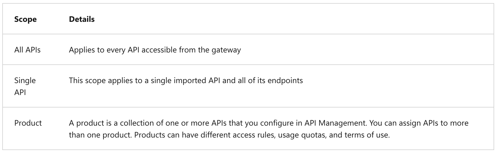
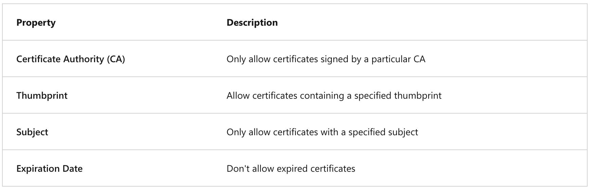
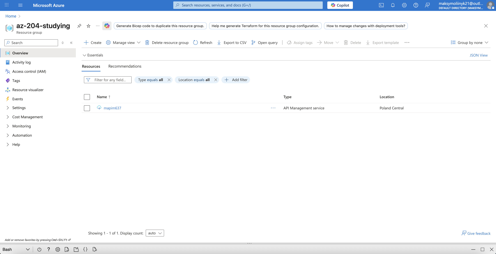
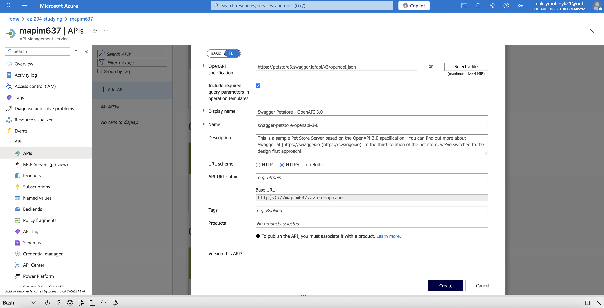
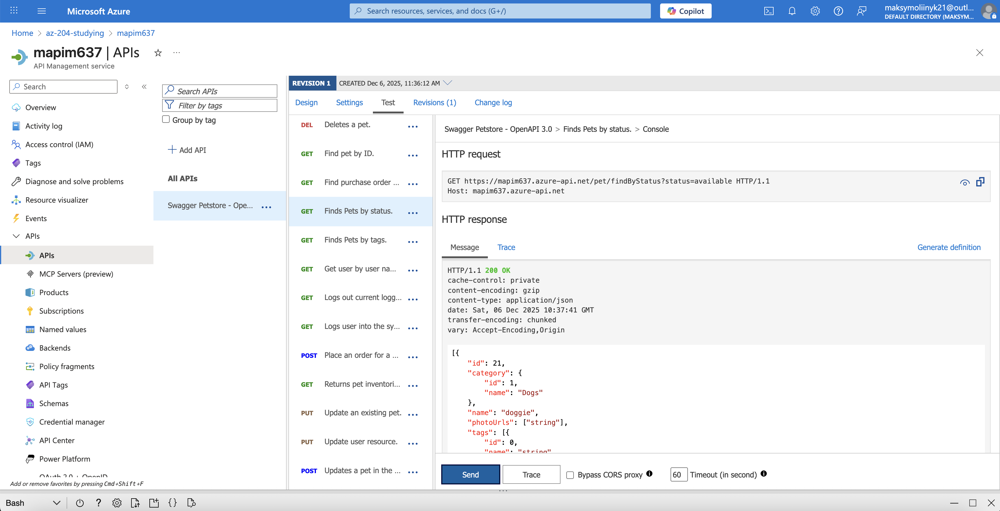

## API Management

### General information

API Management provides the core functionality to ensure a successful API program through developer engagement, business insights, analytics, security, and protection. Each API consists of one or more operations, and each API can be added to one or more products. To use an API, developers subscribe to a product that contains that API, and then they can call the API's operation, subject to any usage policies.

API Management components:

- **API gateway**.
- **Management plane**.
- **Developer portal**.

---

### Groups:

Groups are used to manage the visibility of products to developers. API Management has the following immutable system groups:

- Administrators.
- Developers.
- Guests.

---

### API gateways

The API Management gateway (also called data plane or runtime) is the service component that's responsible for proxying API requests, applying policies, and collecting telemetry.

API Management offers both managed and self-hosted gateways:

- **Managed** - The managed gateway is the default gateway component that is deployed in Azure for every API Management instance in every service tier. With the managed gateway, all API traffic flows through Azure regardless of where backends implementing the APIs are hosted.
- **Self-hosted** - The self-hosted gateway is an optional, containerized version of the default managed gateway. It's useful for hybrid and multicloud scenarios where there's a requirement to run the gateways off of Azure in the same environments where API backends are hosted. The self-hosted gateway enables customers with hybrid IT infrastructure to manage APIs hosted on-premises and across clouds from a single API Management service in Azure.

---

### API Management policies

In Azure API Management, policies allow the publisher to change the behavior of the API through configuration. Policies are a collection of Statements that are executed sequentially on the request or response of an API.

The policy definition is a simple XML document that describes a sequence of inbound and outbound statements. The XML can be edited directly in the definition window.

The configuration is divided into `inbound`, `backend`, `outbound`, and `on-error`. The series of specified policy statements is executed in order for a request and a response.

```xml
<policies>
  <inbound>
    <!-- statements to be applied to the request go here -->
  </inbound>
  <backend>
    <!-- statements to be applied before the request is forwarded to
         the backend service go here -->
  </backend>
  <outbound>
    <!-- statements to be applied to the response go here -->
  </outbound>
  <on-error>
    <!-- statements to be applied if there is an error condition go here -->
  </on-error>
</policies>
```

---

### Advanced policies

**Control flow** - Conditionally applies policy statements based on the results of the evaluation of Boolean expressions (`choose`, `when`, and `otherwise`).
**Forward request** - Forwards the request to the backend service (`forward-request`).
**Limit concurrency** - Prevents enclosed policies from executing by more than the specified number of requests at a time (`limit-concurrency`).
**Log to Event Hubs** - Sends messages in the specified format to an event hub defined by a Logger entity (`log-to-eventhub`).
**Mock response** - Aborts pipeline execution and returns a mocked response directly to the caller (`mock-response`).
**Retry** - Retries execution of the enclosed policy statements, if and until the condition is met. Execution repeats at the specified time intervals and up to the specified retry count (`retry`).

---

### Secure APIs by using subscriptions

When you publish APIs through API Management, it's easy and common to secure access to those APIs by using subscription keys.

_Subscriptions and Keys_:

A subscription key is a unique autogenerated key that can be passed through in the headers of the client request or as a query string parameter. The key is directly related to a subscription, which can be scoped to different areas. Subscriptions give you granular control over permissions and policies.

The three main subscription scopes are:



_Call an API with the subscription key_:

Here's how you can pass a key in the request header using curl:

```bash
curl --header "Ocp-Apim-Subscription-Key: <key string>" https://<apim gateway>.azure-api.net/api/path
```

Here's an example curl command that passes a key in the URL as a query string:

```bash
curl https://<apim gateway>.azure-api.net/api/path?subscription-key=<key string>
```

---

### Secure APIs by using certificates

Certificates can be used to provide Transport Layer Security (TLS) mutual authentication between the client and the API gateway. You can configure the API Management gateway to allow only requests with certificates containing a specific thumbprint. The authorization at the gateway level is handled through inbound policies.

With TLS client authentication, the API Management gateway can inspect the certificate contained within the client request and check for properties like:



---

### Execution example

1. Creation of the APIM instance:

```bash
az apim create -n $myApiName \
    --location $myLocation \
    --publisher-email $myEmail  \
    --resource-group $myResourceGroup \
    --publisher-name Import-API-Exercise \
    --sku-name Consumption
```



2. Importing a backend API:



3. APIM execution:



---
